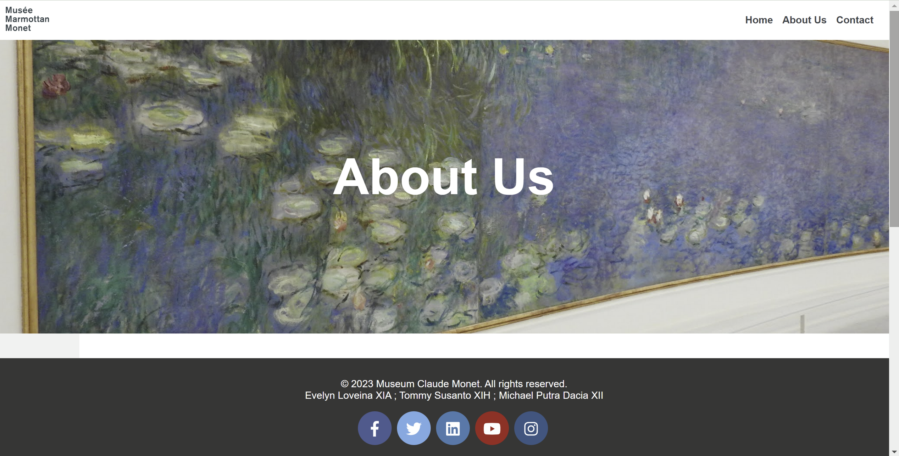

<h1 align="center">The Musée Marmottan Monet</h1>

  <em> The Musée Marmottan Monet is a renowned art museum located in Paris, France, and is home to the world’s largest collection of works by the French Impressionist painter Claude Monet. Nestled in a quiet corner of the city, the museum offers a unique and intimate experience for art lovers, showcasing not only Monet’s iconic pieces but also his lesser-known sketches, pastels, and personal artifacts. The museum's collection traces the evolution of Monet’s style—from his early landscapes to his groundbreaking "Impression, Sunrise" and the dreamy Water Lilies series. Visitors are invited to explore the artist’s life and legacy in a space that reflects both historical richness and artistic serenity. The Musée Marmottan Monet stands as a true celebration of Impressionism and one of its greatest pioneers.
</em>

## 🌐 Live Preview
Visit Website (https://github.com/lyneyy/monet-website.git)

## 🖼️ Preview

This is a visual preview of the Musée Marmottan Monet website project. Designed with soft, elegant tones and an emphasis on visual harmony, the layout reflects the serene and artistic atmosphere of the museum itself. 

